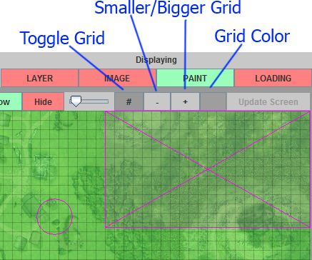

# Dungeon Board

Fork of the useful DungeonBoard https://github.com/McAJBen/DungeonBoard

Often there are maps without grids as D&D is originally Pen and Paper.
<b>I added a grid feature</b> to draw a grid on a picture. The grid is saved
and applied when the image is reloaded.

