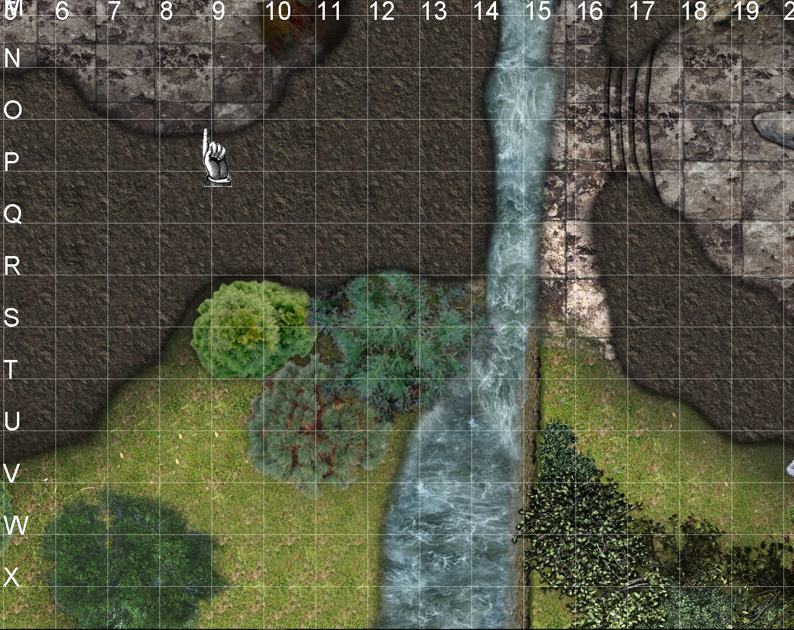

# Dungeon Board

Fork of the useful DungeonBoard https://github.com/McAJBen/DungeonBoard

Often there are maps without grids as D&D is originally Pen and Paper.
<b>I added a grid feature</b> to draw a grid onto an image to use it for tabletop. The grid is saved
and applied when the image is reloaded.

If you move a map the Players need to know where they were standing. Added a coordinate system for this purpose.

## Running Dungeon Board

<a href="https://github.com/desertratxx/DungeonBoard/blob/master/Versions/Dungeon%20Board%20v2.4.1_grid.jar">Download 2.4.1 with Grid</a>
 
When you first run Dungeon Board it will create a folder next to the .jar file. Inside of this are 4 folders (Layer, Image, Paint, Loading). Simply place all of your images you want to display in these folders in the .png format.
The next time you run Dungeon Board it will automatically load these on startup.
  
If you want to run Dungeon Board with more memory allocated you have to run the .jar file from the command line.
 
<i>&nbsp;&nbsp;java -jar -Xmx1000m "Dungeon Board v2.4.1_grid.jar"</i>